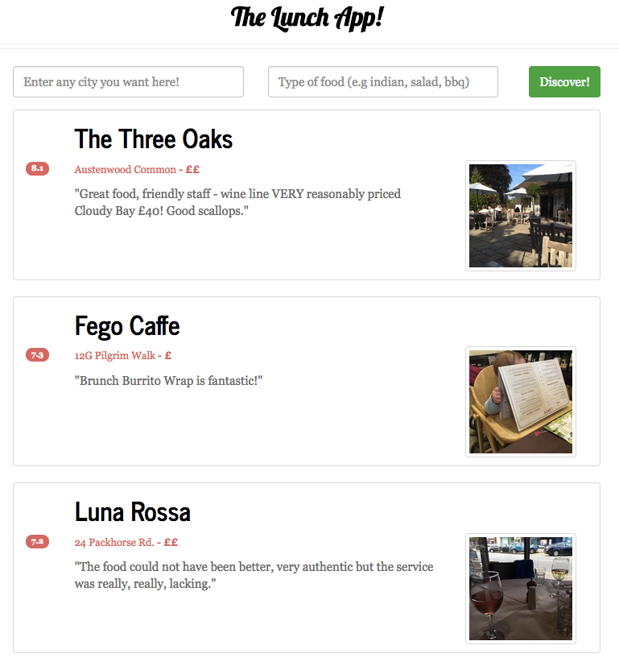
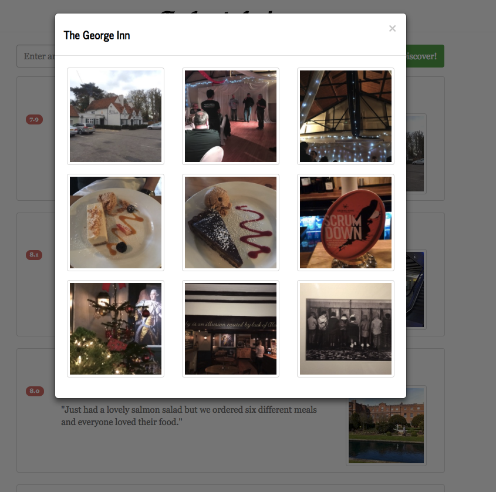

# Lunch-App
> Fun single page web app created to find places to grab lunch nearby. Uses the <a href="https://developer.foursquare.com/docs/">FourSquare API</a> and <a href="https://www.w3schools.com/html/html5_geolocation.asp">HTML5 geolocation</a> to display interesting nearby restaurants to explore.
 

<em>Main Page showing restaurants nearby</em>
 

## External Libraries Used
* AngularJS 1.4.9 - https://angularjs.org/ 
* Angular JS-Toaster - https://github.com/jirikavi/AngularJS-Toaster
* angular-loading-bar - https://github.com/chieffancypants/angular-loading-bar

## Usage
The purpose of this app was to solve a long-standing debate at my workplace about where our team should go for lunch everyday. Due to the difference in opinions, we utilized this app to quickly search for interesting and overlooked restaurants in different areas that we could explore. The decision was often swayed by checking out some of the FourSquare user-uploaded photos that are accessed by clicking on a restaurant's name:

<em>User photos of a restaurant</em>
 

## Inspiration
The inspiration for using Angular JS and the FourSquare API together comes from <a href="https://github.com/tjoudeh">Taiseer Joudeh</a> who had a tutorial for building Single Page Apps using AngularJS at https://github.com/tjoudeh/FoursquareAngularJS

## Contributing

1. Fork it (<https://github.com/yourname/yourproject/fork>)
2. Create your feature branch (`git checkout -b feature/fooBar`)
3. Commit your changes (`git commit -am 'Add some fooBar'`)
4. Push to the branch (`git push origin feature/fooBar`)
5. Create a new Pull Request
